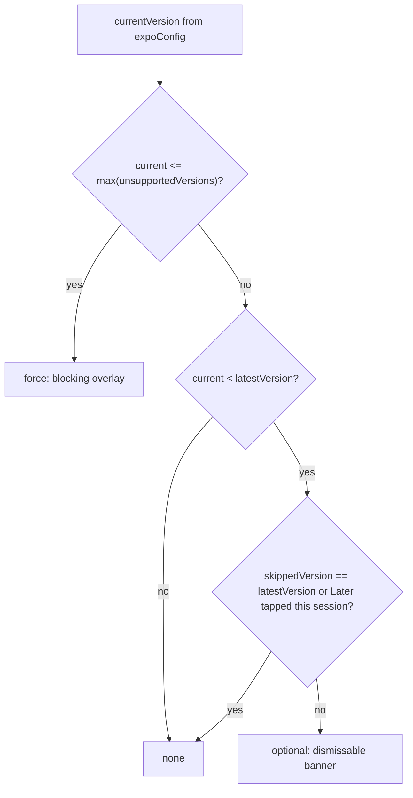
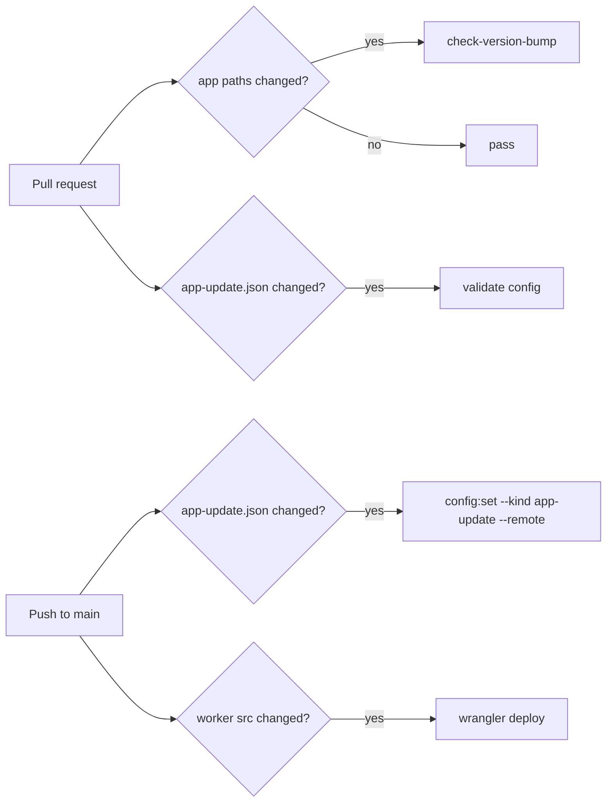

# Config-driven app update banner

Add a remotely configured app-update check, served from the existing app-config Cloudflare worker. Installs older than `latestVersion` get a dismissable banner (Later / Skip this version / Update). Any install at or below the highest version marked unsupported gets a full-screen blocking overlay that leads to the Play Store.

## Implementation todos

- [ ] Add versionCompare, appUpdateSchema, updateDecision with unit tests (TDD)
- [ ] Add /v1/app-update route + --kind flag to config-set, README, worker tests
- [ ] Add appUpdateLoader (ETag + cache), appUpdateStore (later/skip persistence), openStore, loader tests
- [ ] Build AppUpdateBanner (Today tab) and ForceUpdateOverlay (root, hidden on /reminder, BackHandler block), mount AppUpdateBootstrap
- [ ] Add update.* keys to en.ts and website i18n catalogs
- [ ] Add scripts/check-version-bump.ts (+ tests), config:set --validate-only, and .github/workflows/pr-checks.yml with paths-filter
- [ ] Add workers/app-config/config/app-update.json and .github/workflows/deploy-app-config.yml (wrangler deploy + KV put on merge, smoke curl), README secrets setup
- [ ] Run npm run quality and fix issues

## Config shape (KV key `app-update`, served at `GET /v1/app-update`)

```json
{
  "version": 1,
  "android": {
    "latestVersion": "2.1.0",
    "unsupportedVersions": ["1.9.0", "2.0.1"],
    "storeUrl": "https://play.google.com/store/apps/details?id=com.health.os"
  }
}
```

- The config is keyed by platform (`android` is the only key required today). A platform with no entry means no update prompt on that platform.
- **Unsupported floor:** `max(unsupportedVersions)`. Any install at or below the floor is forced to update. So if you mark `2.0.1` unsupported, then `2.0.0`, `1.x`, and every other older version are unsupported too.
- **Worked example:** `unsupportedVersions: ["2.0.1"]`, `latestVersion: "2.0.2"`:
  - `2.0.1`, `2.0.0`, `1.9.3`, `1.0.0` (everything below `2.0.2`): force update (blocking overlay)
  - `2.0.2`: no prompt
  - After you publish `latestVersion: "2.1.0"` without changing `unsupportedVersions`: `2.0.2` gets the optional banner, and `2.0.1` and below stay forced
  - You only list the newest version you want to kill. Older versions never need to be listed. Listing more than one is allowed but redundant, because only the highest entry counts.
- **Validation:** `latestVersion` must be strictly greater than the floor. This stops a bad config from blocking users who are already on the latest version. The same parser runs in the app, the worker, and the `config:set` script.
- **Bundled default:** no config, which means no prompt. The app never blocks users because a fetch failed.

## Decision logic (pure function)



- Versions are compared numerically, part by part (`2.10.0 > 2.9.0`). Missing parts count as 0. A malformed current version is treated as `none`, and a malformed config version is rejected by the schema.
- **Later** is kept in memory only, so the banner comes back on the next launch. **Skip this version** saves `latestVersion` to disk, so the banner stays hidden until you publish a newer `latestVersion`. Skip never suppresses a force update.

## Worker changes: [workers/app-config/src/index.ts](../workers/app-config/src/index.ts)

- Refactor the handler into a small route table: `/v1/observability` maps to KV key `observability`, and `/v1/app-update` maps to KV key `app-update`. Each route has its own parser and default. Reuse the existing ETag, 304, CORS, and `Cache-Control` code.
- [workers/app-config/scripts/config-set.ts](../workers/app-config/scripts/config-set.ts): add `--kind observability|app-update` (default `observability`) to choose the parser and KV key. Add `--validate-only`, which parses the file and exits without writing (CI uses it on PRs).
- New committed source of truth: `workers/app-config/config/app-update.json`. The initial content is `latestVersion: "2.0.2"`, `unsupportedVersions: []`, so the first deploy prompts nobody. Add a README section.

## App: new module `src/features/appUpdate/`

- `versionCompare.ts`: `parseVersion` and `compareVersions`.
- `appUpdateSchema.ts`: `parseAppUpdateConfig` and `BUNDLED_DEFAULT_APP_UPDATE_CONFIG`. The worker imports this file, the same way it imports `configSchema.ts` today.
- `updateDecision.ts`: `resolveUpdateState(currentVersion, platformConfig, { skippedVersion, laterDismissed })` returns `'force' | 'optional' | 'none'`.
- `appUpdateLoader.ts`: fetches `${getObservabilityConfigUrl()}/v1/app-update`. It mirrors [src/core/observability/configLoader.ts](../src/core/observability/configLoader.ts): 10s timeout, ETag, and a cached last-good config.
- `appUpdateStore.ts` (zustand): holds `config`, `laterDismissed`, `skippedVersion`, `dismissLater()`, `skip()`. It hydrates from cache synchronously, so a force update still applies offline. Persistence goes through `readObservabilityKv` / `writeObservabilityKv` from [src/core/observability/observabilityDb.ts](../src/core/observability/observabilityDb.ts), using keys `app_update_config`, `app_update_etag`, and `app_update_skipped`.
- `openStore.ts`: opens `market://details?id=com.health.os` first, then falls back to the config `storeUrl` through `Linking.openURL`. Errors are reported through `crashReporter`.
- `AppUpdateBootstrap.tsx`: refreshes on mount and whenever `AppState` returns to `active`, so a user coming back from the Play Store gets re-evaluated.

## UI

- `src/core/components/AppUpdateBanner.tsx`: a Paper `Banner` in the same style as [ReminderPermissionBanner.tsx](../src/core/components/ReminderPermissionBanner.tsx), with the actions Later, Skip this version, and Update. It renders only on the Today tab ([app/(tabs)/index.tsx](../app/(tabs)/index.tsx)), above the permission banner, so users are not nagged on every screen.
- `src/core/components/ForceUpdateOverlay.tsx`: an absolutely positioned full-screen `View` with the logo, a title, the body text, and a single Update button. It blocks all touches and has no dismiss action. On Android, `BackHandler` is intercepted while the overlay is visible.
- The overlay is mounted in [app/_layout.tsx](../app/_layout.tsx) inside `RootNavigation`, after `<Stack>`. **It is hidden on the `/reminder` route**, so medication alarms can always be acknowledged even on an unsupported build.
- Mount `<AppUpdateBootstrap />` next to `<ObservabilityBootstrap />` in [app/_layout.tsx](../app/_layout.tsx).

## i18n

- Add these keys to [src/i18n/en.ts](../src/i18n/en.ts): `update.optional.body`, `update.later`, `update.skip`, `update.now`, `update.force.title`, `update.force.body`. Add the same keys to every `website/public/i18n/*.json` catalog. English fallback covers any locale that is missing a key.

## Tests (`__tests__/appUpdate/`)

- `versionCompare.test.ts`: ordering, missing parts, `2.10` vs `2.9`, malformed input.
- `appUpdateSchema.test.ts`: valid config; rejects `latestVersion <= floor`; rejects bad semver, a missing platform shape, and a wrong `version` field.
- `updateDecision.test.ts`: force at the floor and below it; optional below latest; none at or above latest; skip and Later hide optional but not force; no platform config.
- `appUpdateLoader.test.ts`: 200 caches the config, 304 returns the cached config, network error returns null.
- Extend [__tests__/observability/workerHandler.test.ts](../__tests__/observability/workerHandler.test.ts): the `/v1/app-update` route returns the stored config or the default, and returns ETag/304.
- Run `npm run quality`.

## CI pipelines (GitHub Actions)



### PR check: `.github/workflows/pr-checks.yml` (`on: pull_request` to `main`)

- The job always runs; there is no workflow-level `paths:` filter. A skipped workflow leaves a required check stuck on "pending", so the job must always report a result. `dorny/paths-filter@v3` sets two outputs:
  - `app`: `app/**`, `src/**`, `modules/**`, `plugins/**`, `assets/**`, `package.json`, `expo.base.json`, `app.config.js` (the same set as [release-apk.yml](../.github/workflows/release-apk.yml))
  - `updateConfig`: `workers/app-config/config/app-update.json`, `src/features/appUpdate/**`
- **Version bump step** (runs when `app` is true): `npx tsx scripts/check-version-bump.ts`. The script:
  - Reads the base version with `git show origin/${{ github.base_ref }}:expo.base.json` (checkout uses `fetch-depth: 0`), and reads the head version from the working tree.
  - Fails unless `compareVersions(head, base) > 0`, reusing `src/features/appUpdate/versionCompare.ts`.
  - Fails unless `package.json` `version` equals the `expo.base.json` version, since today both are `2.0.2` and should not drift.
  - Prints a clear message, for example: `expo.base.json version 2.0.2 must be greater than main (2.0.2). Bump it or remove app changes.`
- **Config validation step** (runs when `updateConfig` is true): `npm run config:set -- config/app-update.json --kind app-update --validate-only`, plus a check that `android.latestVersion` is less than or equal to the head `expo.base.json` version. This stops anyone from advertising a version that doesn't exist yet.
- Unit tests: `__tests__/scripts/checkVersionBump.test.ts` covers the pure compare/format logic, which is exported from the script.

### Deploy on merge: `.github/workflows/deploy-app-config.yml` (`on: push` to `main`)

- Uses `paths:` `workers/app-config/**` and `src/features/appUpdate/**`. This workflow is not a required check, so a path filter is fine here.
- `concurrency: deploy-app-config`, without cancel-in-progress, so KV writes happen in merge order.
- Steps: checkout (with `fetch-depth: 2`), Node 22, `npm ci` at the repo root (the worker scripts import `src/`), then `npm ci` in `workers/app-config`.
- Uses `dorny/paths-filter` again, with `base: ${{ github.event.before }}`:
  - Worker src or `src/features/appUpdate/**` changed: run `npx wrangler deploy`. This runs first, so the `/v1/app-update` route exists before the KV write.
  - `config/app-update.json` changed: run `npm run config:set -- config/app-update.json --kind app-update --remote`.
  - After deploying, run `curl -fsS https://config.healthos.ritik.cc/v1/app-update` as a smoke check.
- Secrets: `CLOUDFLARE_API_TOKEN` (scoped to Workers Scripts:Edit and Workers KV Storage:Edit) and `CLOUDFLARE_ACCOUNT_ID`, passed as env. No secrets are committed. Add setup notes to the worker README.

## Release workflow (documented in the worker README)

1. App PR: bump `version` in [expo.base.json](../expo.base.json) and `package.json`. The PR check enforces this.
2. Build and upload the `.aab` to Play, then wait for the rollout to go live.
3. Config PR: edit `workers/app-config/config/app-update.json` (`latestVersion`, and optionally `unsupportedVersions`). The PR check validates it, and the merge deploys it automatically.
4. To shut off old builds: add a version to `unsupportedVersions` in the same file. That version and everything below it are forced to update within about 15 minutes of their next launch or foreground.
